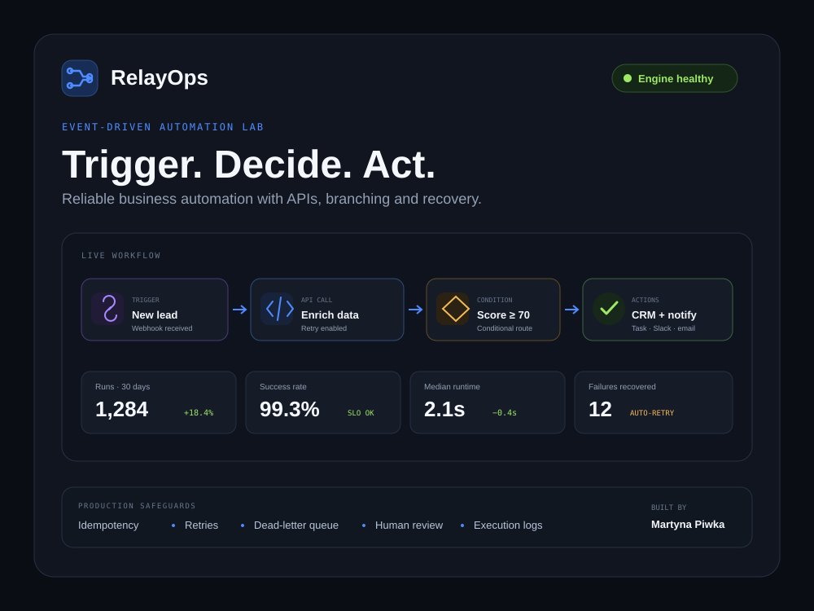
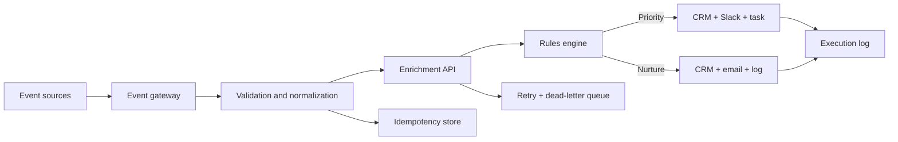

# RelayOps: Event-Driven Automation Studio



**Live demo:** [piwkamartyna.github.io/relayops-automation-studio](https://piwkamartyna.github.io/relayops-automation-studio/)

RelayOps is an interactive portfolio case study showing how a business event becomes a reliable operational outcome. The demo processes a synthetic inbound lead through webhook validation, field normalization, company enrichment, scoring, branching and downstream actions, while exposing retries, idempotency and execution logs.

## The problem

Many business automations work only on the happy path. A trigger fires and an action happens, but duplicate events, API timeouts, malformed payloads and ambiguous decisions create silent failures or bad data.

RelayOps demonstrates a production-minded approach:

1. Accept and authenticate an event.
2. Validate and normalize its payload.
3. Enrich context through an external API.
4. Apply explicit, versioned decision rules.
5. Route the event to the correct action path.
6. Record every decision and recover safely from failure.

## Interactive scenarios

The live demo includes four test events:

| Scenario | Decision | Result |
| --- | --- | --- |
| Enterprise lead with high intent | Score ≥ 70 | CRM upsert, Slack alert and owner task |
| Small team with early interest | Score < 70 | CRM nurture stage, email sequence and decision log |
| Enrichment API timeout | Retry with backoff | Second attempt succeeds and execution is marked recovered |
| Duplicate webhook | Idempotency key already exists | Downstream actions are skipped safely |

## Architecture



More detail: [architecture and reliability](docs/architecture.md).

## Production safeguards

- Idempotency keys prevent duplicate downstream actions.
- Schema validation rejects incomplete or unsafe payloads.
- External requests use bounded retries and exponential backoff.
- Failed events retain their payload and error context for replay.
- Ambiguous cases can be routed to human review.
- Each run records the rule version, route, outputs and duration.

## What this project demonstrates

- Workflow automation and business process design
- Webhooks, API integrations and JSON payload handling
- Conditional logic, routers and data transformation
- CRM, Slack and email automation patterns
- Error handling, retries, idempotency and observability
- Automation UX that explains what happened and why

## Tech stack

- Semantic HTML, modern CSS and vanilla JavaScript
- Zero runtime dependencies
- GitHub Actions and GitHub Pages
- Synthetic data and simulated integrations

The architecture is vendor-neutral and can be implemented in **n8n, Make, Zapier or a custom API service**.

## Repository structure

```text
dist/                   Interactive static demo
docs/                   Architecture, workflow contract and QA matrix
examples/               Reference event handler and sample payloads
.github/workflows/      GitHub Pages deployment
```

## Run locally

Serve the `dist` directory with any static server, for example:

```bash
npx serve dist
```

## Data and privacy

RelayOps uses a fictional company, synthetic event payloads and simulated outcomes. It contains no employer, client or production data.

## About the builder

Designed and built by **Martyna Piwka**, focused on workflow automation, API integrations, CRM systems and reliable business operations.

[LinkedIn](https://www.linkedin.com/in/martynapiwka/) · [GitHub](https://github.com/piwkamartyna)
