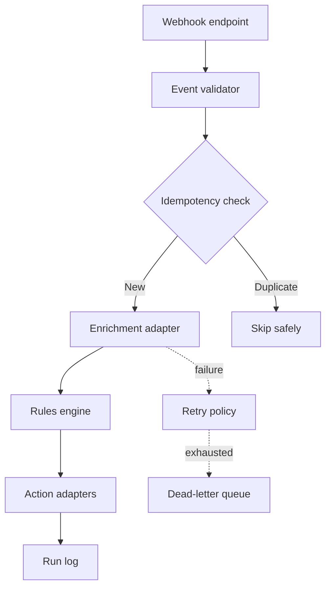

# Architecture and reliability

RelayOps separates event intake, decision logic and downstream side effects. This keeps the automation testable and makes failure recovery possible without replaying every action.

## Processing stages

| Stage | Responsibility | Failure behavior |
| --- | --- | --- |
| Event gateway | Authenticate requests, assign correlation ID and enforce payload limits | Reject invalid requests before workflow execution |
| Validation | Check schema, required fields, consent and normalized formats | Return a structured validation error |
| Idempotency | Reserve the event key before side effects | Skip an event that has already completed |
| Enrichment | Add company and intent context through an external API | Retry transient failures, preserve permanent failures |
| Rules engine | Evaluate versioned conditions against normalized data | Route ambiguous cases to human review |
| Action layer | Write CRM data, send alerts and create tasks | Record each action independently for safe replay |
| Observability | Store timing, route, outputs and errors | Alert on SLO breach or repeated integration failure |

## Reliability contract

- Every event carries an immutable `event_id` and `idempotency_key`.
- Side effects are recorded independently so a replay does not repeat completed actions.
- Retries apply only to transient errors such as timeouts and rate limits.
- Retry delay follows exponential backoff with jitter and a fixed maximum.
- Permanent errors enter a dead-letter queue with their original payload.
- Manual replay requires an operator reason and creates a new correlated run.
- Rule decisions store `rule_version`, inputs and the selected route.

## Example service boundaries

